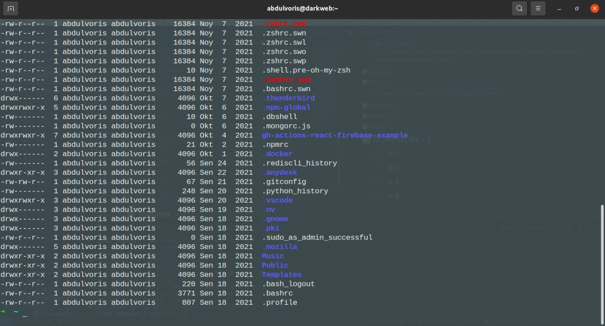

# **Linux Homework 2**

### 🔰Task 2.1

  - 

### 🔰Task 2.2

- **cd** - turgan joyimizdan ya'ni kataloglarni o'zgartirish uchun ishlatamiz. Masalan hozi tugan joyimizdan bitta orqa papkaga chiqish uchun *cd ..* quyidagicha yozamiz.

- **pwd** - bu buyruq hozir turgan joyimizni papkamizni ko'rsatadi.

- **mkdir** - bu buyruq yangi papka ochishimiz uchun hizmat qiladi.

- **chmod** - bu buyruq papka va fayllarni foydalanuvchi ruxsatlarini o'zgartirish uchun ishlatamiz.

- **ls** - bu buyruq hozirga turgan papkamizni ichida nimalar borligini ko'rsatadi.

- **touch** - bu buyruq yangi fayl ochimiz uchun kerak.

### 🔰Task 2.3

  

  Rasmda ko'rsatilgan buyruqlarda sizda savol tug'ilgan bo'lishi tabiiy ya'ni u joydagi 
     
  
  bu qator nimani bildiradi. Buni yaxshiroq tushunish uchun quyidagi  [link](https://www.youtube.com/watch?v=xSSYJfNTSqY) orqali videoni tomosha qilishingiz mumkin.

### 🔰Task 2.4

-  **\*** - bu buyruq ishlatilgan  joyda shuni tushunishimiz mumkinki u joydagi hamma narsani belgilab uni uni ustida amal bajarishimizni bildiradi.

- **?** - bu buyruq o'zidan keyingi kelgab belgi larni istalgancha ishlatilishini bildiradi.  

- **[....]** - bu buyruq qavslar orasidagi istalgan belgi, raqamlar yozish mumkinligini bildiradi.

### 🔰Task 2.5

 - **<** - bu buyruq mavjud fayldagi ma'lumotlarni yangi faylga kiritish uchun ishlatiladi.
 - **>** - bu buyruq mavjud fayl yoki bazadagi ma'lumotlarni yangi faylga chiqarib olish uchun ishlatiladi.
 - **2>** - bu buyruq
 - **&>** - bu buyruq
 - **>>** - bu buyruq ichida ma'lumoti bor faylni ichiga yana boshqa fayldan qo'shimcha narsani yana yuklash imkoniyatini beradi.
### 🔰Task 2.6

 - **-** - bu belgi bizga mavjud ma'lumotni oddiy papka ekanligini bildiradi.
 - **d** - bu belgi bizga mavjud ma'lumotni fayl ekanligini bildiradi.
 - **l** - bu belgi bizga mavjud ma'lumotni link ekanligini bildiradi.
 - **c** - bu belgi bizga mavjud ma'lumotni 
 - **s** - bu belgi bizga mavjud ma'lumotni localniy socket fayli ekanligini bildiradi. Socket degani meni o'rganganimcha localniy socket file sizda bo'lsa yangi user yaratganizda u kerak bo'ladi u socket file ichiga o'sha yaratgan userizni ichida oldindan ma'lumot yaratib qo'yish uchun kerak ayniqsa katta kompaniyalarda ko'p ishlatiladi yoki davlat organlarida ya'ni **s** belgi o'sha faylni ko'rsatadi.
 - **p** - bu belgi bizga mavjud ma'lumotni 
 - **b** - bu belgi bizga mavjud ma'lumotni
### 🔰Task 2.7

- **Read, write va execute** ruxsatlarni o'rganishda men 
  
  bu rasm orqali tushuntirsam  birinchi ustunni ya'ni*d rwx rwx rwx* ni bu ko'rinishda 4 qismga bo'lib o'rganish kerak nima uchun aynan 4 qisam ga deb savol tug'ilsa bu 4 qismni har birini o'z vazifalari alohida bo'lgani uchun, 1-**FAYL** turi, 2-**USER** ruxsatlari, 3-**GROUP** ruxsatlari, 4-**FOYDALANUVCHI** lar uchundir. 
  - Birinchi qismimiz ya'ni ***d*** bu bizda faylimizni qanaqa turda ekanligini ko'rsatadi yuqorida ta'riflaganimizdek.
  - Ikkinchi qismimizda ya'ni ***rwx*** bu bizda faylimizni **USER** i uchundir ya'ni userimizni huquqlari belgilangan,
    - *r* - belgisi o'qish uchun ruxsati borligini bildiradi.
    - *w* - belgisi yozish huquqi borligini bildiradi.
    - *x* - belgisi ma'lumotni mavjud ekanligini bildiradi.
    * *-* - belgisi esa hech qanaqa ruxsat yoqligini bildiradi.
  huddi shunday GROUP va FOYDALANUVCHIlar uchun ham shu qonun o'rinlidir.

  😳 Qo'shimcha ma'lumot aytadigan bo'lsam yana bularni kodda ruxsatlarni boshqarayotganimizda raqamlardan ham ko'p foydalanamiz ya'ni

    - **r** = 4;
    - **w** = 2;
    - **x** = 1;
    - **-** = 0;
  
bu sizga fayllarni ruxsatlarini o'qishni yana bir usulidir.
  📝 Masalan: rw- = 6; user uchun bo'lsa r-x = 5; group uchun bo'lsa --x = 1; foydalanuvchilar uchun bo'lsa demak umumiy ruxsatlar bizda 651 ga teng bo'ldi🔗
### 🔰Task 2.10

### 🔰Task 2.11
### 🔰Task 2.12

## **✅ HOMEWORK - 2**
- ## **📍 h-1**

- ## **📍 h-2**

- ## **📍 h-3**

- ## **📍 h-4**

