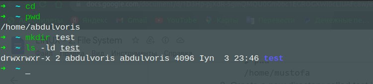
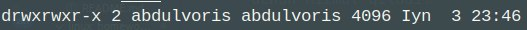

# **Linux Homework 2**

### 🔰Task 2.1

  - 

### 🔰Task 2.2

- **cd** - turgan joyimizdan ya'ni kataloglarni o'zgartirish uchun ishlatamiz. Masalan hozi tugan joyimizdan bitta orqa papkaga chiqish uchun *cd ..* quyidagicha yozamiz.

- **pwd** - bu buyruq hozir turgan joyimizni papkamizni ko'rsatadi.

- **mkdir** - bu buyruq yangi papka ochishimiz uchun hizmat qiladi.

- **chmod** - bu buyruq papka va fayllarni foydalanuvchi ruxsatlarini o'zgartirish uchun ishlatamiz.

- **ls** - bu buyruq hozirga turgan papkamizni ichida nimalar borligini ko'rsatadi.

- **touch** - bu buyruq yangi fayl ochimiz uchun kerak.

### 🔰Task 2.3

  

  Rasmda ko'rsatilgan buyruqlarda sizda savol tug'ilgan bo'lishi tabiiy ya'ni u joydagi 
     
  
  bu qator nimani bildiradi. Buni yaxshiroq tushunish uchun quyidagi  [link](https://www.youtube.com/watch?v=xSSYJfNTSqY) orqali videoni tomosha qilishingiz mumkin.

### 🔰Task 2.4

-  **\*** - bu buyruq ishlatilgan  joyda shuni tushunishimiz mumkinki u joydagi hamma narsani belgilab uni uni ustida amal bajarishimizni bildiradi.

- **?** - bu buyruq o'zidan keyingi kelgab belgi larni istalgancha ishlatilishini bildiradi.  

- **[....]** - bu buyruq qavslar orasidagi istalgan belgi, raqamlar yozish mumkinligini bildiradi.

### 🔰Task 2.5

 - **<** - bu buyruq mavjud fayldagi ma'lumotlarni yangi faylga kiritish uchun ishlatiladi.
 - **>** - bu buyruq mavjud fayl yoki bazadagi ma'lumotlarni yangi faylga chiqarib olish uchun ishlatiladi.
 - **2>** - bu buyruq
 - **&>** - bu buyruq
 - **>>** - bu buyruq ichida ma'lumoti bor faylni ichiga yana boshqa fayldan qo'shimcha narsani yana yuklash imkoniyatini beradi.
### 🔰Task 2.6

### 🔰Task 2.7
### 🔰Task 2.10

### 🔰Task 2.11
### 🔰Task 2.12

## **✅ HOMEWORK - 2**
- ## **📍 h-1**

- ## **📍 h-2**

- ## **📍 h-3**

- ## **📍 h-4**

